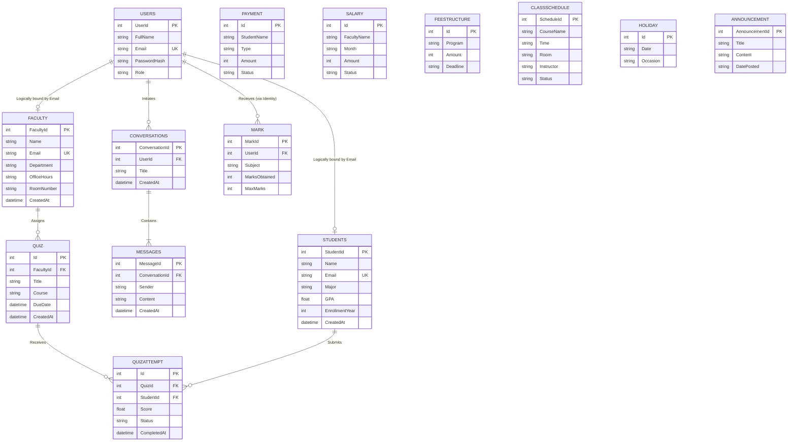

# SAFECHATBOT Entity-Relationship Diagram

Below is the generated ER Diagram outlining all tables and constraints utilized across your platform. 
*(If your IDE or markdown viewer supports Mermaid.js, you will see a visual representation of the boxes and foreign keys!)*

